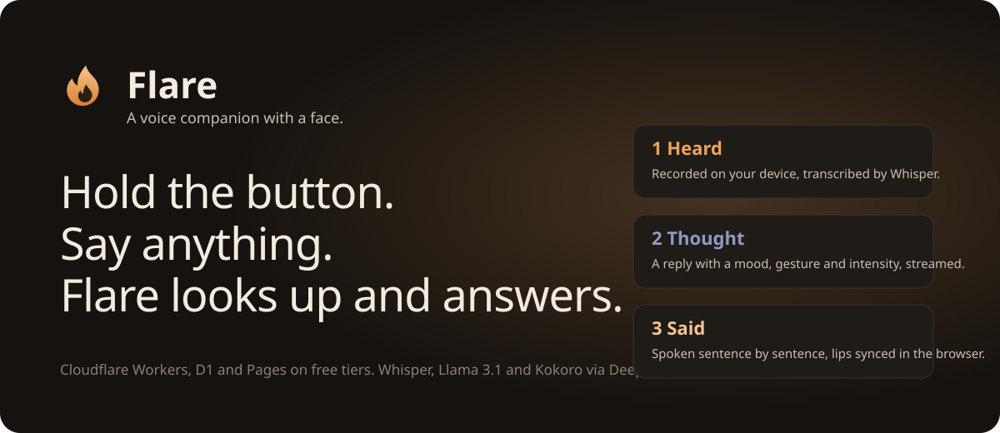

# Flare

<p align="center">
  
</p>

<!-- Record docs/demo.gif following docs/recording-the-demo.md, then uncomment:
<p align="center"></p>
-->

A voice companion with a face. Hold a button, or just talk, and a 3D character listens,
thinks, and answers out loud with a mood, a gesture, and lip-sync computed in your browser.
It starts speaking before it has finished thinking, and it answers in your language.

Flare runs entirely on free tiers: Cloudflare Pages, Workers, D1, Rate Limiting and
Turnstile; Clerk for sign-in; DeepInfra for speech-to-text, the language model and
text-to-speech.

## What it does

- **Two ways to talk.** Hold the button (or Space) and release to send, or switch on
  hands-free: Silero VAD, a small neural voice detector, runs on your device and sends a turn
  when you pause, with an energy gate as fallback. Hands-free is half-duplex unless you turn
  on "interrupt by speaking".
- **Replies that stream.** The model's words arrive as a stream; each sentence is voiced the
  moment it is complete, so the first words play while the rest is still being written.
- **A character that reacts.** Ten moods scaled by how strongly they are felt, procedural
  nods and shakes, laugh and dance clips, gaze that follows you and glances away, breathing,
  weight shifts, small acknowledgements while you speak, and stage light that follows the
  conversation. Lips are timed from the text and driven by the sound. Try it on the
  how-it-works page.
- **Your language.** Speak Spanish, French, Hindi, Italian, Japanese, Portuguese or Chinese
  and Flare answers in it with a native voice of the register you chose.
- **Your Flare.** Eight voices with previews, four personalities, your name in the prompt.
- **Your data.** Transcript export and copy, pin and archive, per-conversation delete, and
  one button that erases everything. Audio is never stored.
- **Invite-only.** A public request form (honeypot, IP rate limit, Turnstile when
  configured) and an admin page that approves requests and sends Clerk invitations.
- **Spend guard.** A daily turn cap per user, with a warning when ten are left.
- **Self-describing API.** OpenAPI generated from the shared Zod contracts at `/api/docs`.

## How a turn works

```
browser ──audio──▶ Worker ──▶ Whisper                    (1) transcribe, detect language
browser ──text───▶ Worker ──▶ D1 + Llama (stream) ──▶ Kokoro per sentence
browser ◀─SSE────  Worker      words, mood, gesture, intensity, then MP3 per sentence  (2)
browser ◀─mp3────  Worker ◀── Kokoro                      (3) replays only
```

The reply is one server-sent event stream: a tag line with the emotion, gesture, intensity
and (on a new thread) title, then text deltas, then base64 MP3 for each sentence in order.
Every Worker invocation stays well under the free plan's 10 ms CPU budget: the Worker never
decodes audio or parses uploads; the browser records, detects speech, meters input, plays
audio and animates the face.

The character is deterministic apart from three values the model chooses with its reply
(emotion, gesture, intensity). Everything else is a state machine on the client.

## Repository layout

```
apps/
  api/          Cloudflare Worker (Hono): auth, validation, rate limiting, streaming turns,
                voices, invites, admin, OpenAPI
  web/          Next.js static export: landing, how it works, help, invite, privacy, terms,
                changelog, assistant, settings, admin, sign-in
    models-src/ the original GLB files; public/models holds the optimised builds
    scripts/    prepare-public (CSP headers, VAD assets), optimize-models, extract-clip
packages/
  contracts/    Zod schemas and types shared by the Worker and the client
  db/           D1 repositories and migrations
terraform/      D1, R2 and Pages, split into modules
docs/           poster, demo recording notes
.github/        CI (every push and PR) and deploy (main)
```

## Local development

Requirements: Node 22 (see `.nvmrc`) and npm.

```sh
npm ci
npm run dev:api       # Worker on http://127.0.0.1:8787 with a local D1
npm run dev:web       # Next.js on http://localhost:3000 (runs prepare:public first)
```

The Worker needs `DEEPINFRA_API_KEY` and either `CLERK_JWT_KEY` or `CLERK_SECRET_KEY` to
serve real turns; the web client needs `NEXT_PUBLIC_CLERK_PUBLISHABLE_KEY` and
`NEXT_PUBLIC_API_URL`. In this project those values are provided by the deployment pipeline
rather than local files. To run against real services locally, `apps/api/.dev.vars.example`
lists the Worker variables (`wrangler dev` reads `.dev.vars`, which is git-ignored), and the
web client reads `.env.local` (see `apps/web/.env.example`).

Everything that does not need a provider works without any configuration:

```sh
npm run check         # typecheck + lint + format check + tests + build, all workspaces
npm test              # Worker tests run on workerd with a real local D1
npm run db:migrate:local
npm run models:optimize --workspace=@flare/web   # rebuild public/models from models-src
```

## Deployment

Pushing to `main` runs `.github/workflows/deploy.yml`: verify, Terraform apply, D1
migrations, Worker secrets and deploy, web build, Pages deploy. Pull requests and other
branches run `.github/workflows/ci.yml`.

### GitHub secrets

| Secret                              | Used for                                                                              |
| ----------------------------------- | ------------------------------------------------------------------------------------- |
| `CLOUDFLARE_ACCOUNT_ID`             | Terraform, Wrangler                                                                   |
| `CLOUDFLARE_API_TOKEN`              | Terraform, Wrangler (D1, R2, Pages, Workers)                                          |
| `R2_ACCESS_KEY_ID`                  | Terraform state backend                                                               |
| `R2_SECRET_ACCESS_KEY`              | Terraform state backend                                                               |
| `DEEPINFRA_API_KEY`                 | Worker secret                                                                         |
| `CLERK_SECRET_KEY`                  | Worker secret: session verification via JWKS, admin role lookups, sending invitations |
| `CLERK_JWT_KEY`                     | Worker secret, optional: networkless verification                                     |
| `TURNSTILE_SECRET_KEY`              | Worker secret, optional: bot check on the invite form                                 |
| `NEXT_PUBLIC_CLERK_PUBLISHABLE_KEY` | Web build                                                                             |
| `NEXT_PUBLIC_API_URL`               | Web build, e.g. `https://flare-api.<acct>.workers.dev`                                |
| `NEXT_PUBLIC_ASSETS_URL`            | Web build, optional: serve models from R2 instead                                     |
| `NEXT_PUBLIC_TURNSTILE_SITE_KEY`    | Web build, optional: pairs with `TURNSTILE_SECRET_KEY`                                |
| `NEXT_PUBLIC_REPO_URL`              | Web build, optional: "Source code" link in the footer                                 |

`CLERK_JWT_KEY` is the PEM public key from Clerk Dashboard, API keys, "Show JWT public key".
Store it with real newlines or with literal `\n`; the Worker accepts both.

### Non-secret configuration

`apps/api/wrangler.jsonc` holds the model names, the D1 binding, rate limits,
`DAILY_TURN_LIMIT` (turns per user per UTC day, default 300) and `ALLOWED_ORIGINS`
(comma separated, `*` allowed once per host, e.g. `https://*.flare-web.pages.dev`). Origins
listed there are also passed to Clerk as authorized parties, so a session token minted for
another site is rejected.

Voices, languages and personalities are defined in `packages/contracts/src/voices.ts`; add
an entry there and it appears in settings and is accepted by the API.

The web build writes `public/_headers` (Content Security Policy and caching) from the public
configuration and copies the VAD assets from `node_modules`; both are git-ignored.

### Clerk dashboard

- Restrictions: turn on **Restricted** sign-up mode so only invited users can create
  accounts. This is included in the free plan.
- Admins: set `{"role": "admin"}` as a user's public metadata. The Worker reads it from the
  session token when your session token template includes
  `{"metadata": "{{user.public_metadata}}"}`, otherwise it asks the Backend API using
  `CLERK_SECRET_KEY`. Admins see a shield icon in the sidebar that opens `/admin`, where
  approving a request sends the Clerk invitation (with `CLERK_SECRET_KEY` set).
- Allowed origins / redirect URLs: add the Pages hostname and `http://localhost:3000`.

### Cloudflare dashboard

- Nothing beyond the API token and account ID; Terraform creates D1, R2 and Pages, and
  Wrangler creates the Worker, its Rate Limiting bindings and secrets.
- Optional: create a Turnstile widget (free) for the Pages hostname and add its site key and
  secret key as the two Turnstile secrets above.
- Workers Logs are enabled in `wrangler.jsonc` and show up under the Worker's Logs tab.

## Cost and limits

- Workers free: 100k requests/day, 10 ms CPU per request. A turn is two requests (transcribe
  and the reply stream) plus one per replay; each is a few milliseconds of CPU.
- Rate limits: 40 turn-stage calls and 240 API calls per user per minute, 6 invite requests
  per IP per minute (all per Cloudflare location). Daily cap: 300 turns per user.
- LLM tokens: one streaming call per turn with a short system prompt; conversations past 20
  messages are folded into a rolling summary in the background.
- DeepInfra is pay-as-you-go; Whisper is billed per minute of audio and Kokoro per character.
  Voice previews are cached by the browser for a day.
- First hands-free use downloads the neural detector (about 2 MB model plus a 14 MB
  runtime, cached for a year); the energy gate needs nothing.

## Verification

```sh
npm run check
terraform -chdir=terraform fmt -check -recursive
terraform -chdir=terraform init -backend=false && terraform -chdir=terraform validate
```

The API reference is live at `<api>/api/docs`.
